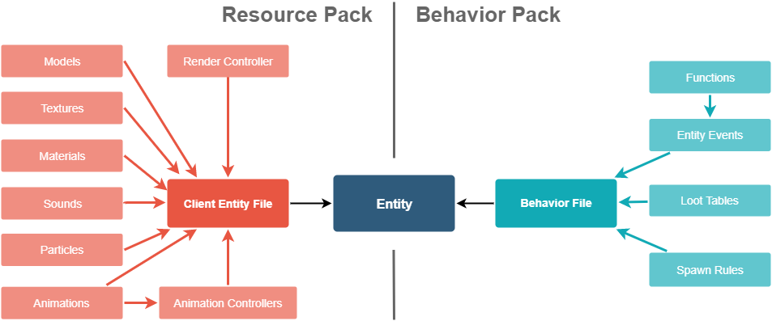

# 마인크래프트 애드온 팩 튜토리얼

## [리소스 팩 안내](https://learn.microsoft.com/ko-kr/minecraft/creator/documents/resourcepack)
```bash
cd resourcepack
make install
```

## [행동 팩 안내](https://learn.microsoft.com/ko-kr/minecraft/creator/documents/behaviorpack)
```bash
cd behaviorpack
make install
```

## [개체 추가 안내](https://learn.microsoft.com/ko-kr/minecraft/creator/documents/introductiontoaddentity)
```bash
cd introductiontoaddentity
make install
```

### 파일 구조

